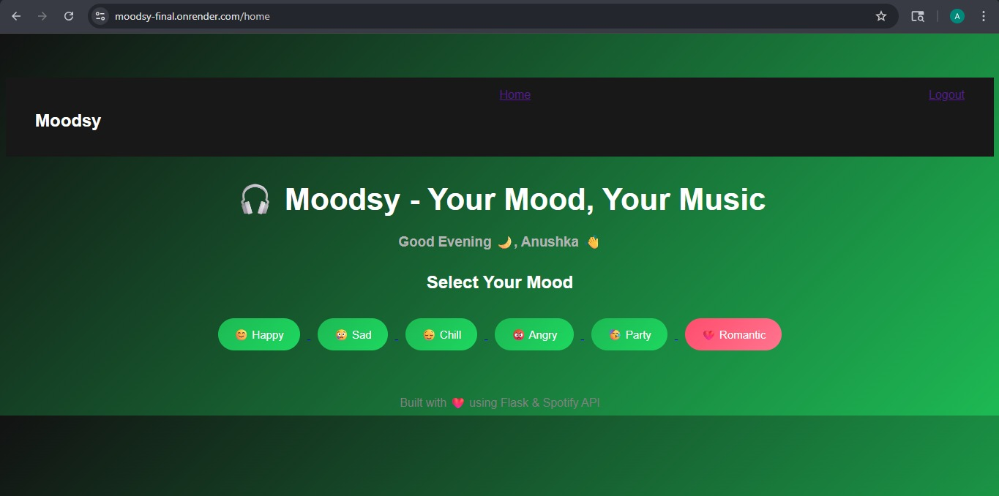
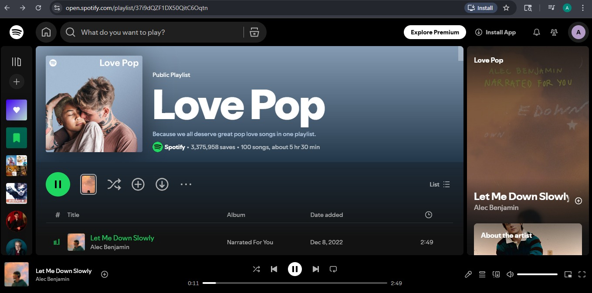

<h1 align="center">🎧 Moodsy</h1>

  <i>Mood-based Spotify playlist generator</i>

  <a href="https://moodsy-final.onrender.com"><b>🌐 Live Demo</b></a>

---

>⚠️ Note: This app is hosted on Render's free tier and may take up to 30–60 seconds to load initially.

✨ Overview

Moodsy is a simple web app that generates Spotify playlists based on your mood.
It uses the Spotify API to fetch tracks dynamically and provides a quick way to discover music that matches how you feel.

---

🎥 Demo

📸 Screenshots

🚀 Features

- 🔐 Spotify OAuth login
- 😊 Mood-based playlist generation
- 🎵 Dynamic track fetching using Spotify API
- ⚡ Clean and responsive UI
- 🌐 Fully deployed on Render
- 💡 Works without Spotify Premium

---

🛠 Tech Stack

Category| Tech
Backend| Flask (Python)
API| Spotify Web API
Frontend| HTML, CSS
Deployment| Render
Server| Gunicorn

---

⚙️ How It Works

1. User logs in via Spotify
2. Selects a mood
3. App fetches playlist using Spotify API
4. Playlist is displayed instantly

---

🔐 Environment Variables

To run this project locally, create a ".env" file:

SPOTIFY_CLIENT_ID=your_client_id
SPOTIFY_CLIENT_SECRET=your_client_secret
REDIRECT_URI=http://127.0.0.1:5000/callback

---

🧩 Challenges & Learnings

- Implemented Spotify OAuth authentication flow
- Managed environment variables securely
- Fixed deployment issues (redirect URI, 404/500 errors)
- Learned API integration with Flask

---

💡 Future Improvements

- Save playlists directly to user’s Spotify account
- Add more moods and filters
- Improve UI/UX
- Add search functionality

---

⚠️ Notes

- Free-tier deployment may take a few seconds to wake up
- No Spotify Premium required

---

👩‍💻 Author

Anushka Keche

---

  ⭐ If you like this project, consider giving it a star!

